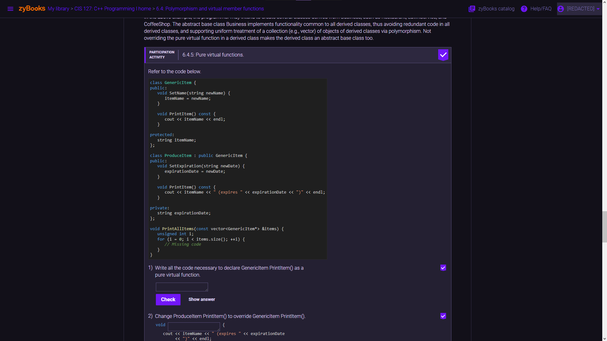

# Amity GX Mod

## Included features

- [Theme](#theme)
- [Wallpaper](#wallpaper)
- [Webmods](#webmods)

## Theme

| Theme | Background                                                                         | Accent                                                                             |
| :---: | :--------------------------------------------------------------------------------: | :--------------------------------------------------------------------------------: |
| light |  hsl(256, 23%, 16%) |  hsl(264, 94%, 53%) |
| dark  |  hsl(256, 23%, 88%) |  hsl(264, 94%, 53%) |

## Wallpaper

| Theme | Wallpaper[^1]                                                                                                                                                                                |
| :---: | :------------------------------------------------------------------------------------------------------------------------------------------------------------------------------------------: |
| light | [Amity](./src/wallpaper/amity-by-lenix.png)                             &mdash; Created by [Len](https://twitter.com/lenix_tt)                        |
| dark  | [Orbiting Russel's Teapot](./src/wallpaper/orbiting-russels-teapot.png) &mdash; Created by [Amity Slime](https://twitter.com/amysmilebatto)  |

[^1]: I own the rights to all images used in this project.

## Webmods

The webmods more or less just makes certain sites more theme-friendly.

| Webmod                                          | Status                            | Issues                                                                    | Example                                                           |
| :---------------------------------------------- | :-------------------------------: | :-----------------------------------------------------------------------: | :---------------------------------------------------------------: |
| [Twitter](https://twitter.com/)                 | complete[^2]                      | [Twitter webmod issues](./issues?q=label%3A"webmod%3A+Twitter")           |            |
| [cppreference](https://cppreference.com/)       | complete[^2]                      | [cppreference webmod issues](./issues?q=label%3A"webmod%3A+cppreference") |  |
| [zyBooks](https://zybooks.com/)                 | [in progress](./tree/development) | [zyBooks webmod issues](./issues?q=label%3A"webmod%3A+zyBooks")           |            |
| [Google](https://google.com/)                   | [in progress](./tree/development) | [Google webmod issues](./issues?q=label%3A"webmod%3A+Google")             |              |
| [ALEKS](https://aleks.com/)                     | [in progress](./tree/development) | [ALEKS webmod issues](./issues?q=label%3A"webmod%3A+ALEKS")               |                |
| [MDN docs](https://developer.mozilla.org/)      | not started                       | n/a                                                                       | n/a                                                               |
| [GitHub](https://github.com/)                   | not started                       | n/a                                                                       | n/a                                                               |
| [Microsoft Learn](https://learn.microsoft.com/) | not started                       | n/a                                                                       | n/a                                                               |
| [YouTube](https://youtube.com/)                 | not started                       | n/a                                                                       | n/a                                                               |

[^2]: Status of "complete" does not mean I won't work on it further if bugs are brought to my attention.

Feel free to give me any suggestions you have or problems you encounter!
If you find an issue with the incomplete sites, it's likely I already know and am working on them. But it would be very helpful if you can let me know about any issues you find in the sites marked as complete.

Thank you! I hope you enjoy! ^w^
